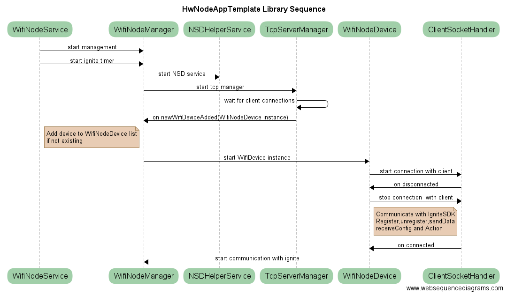
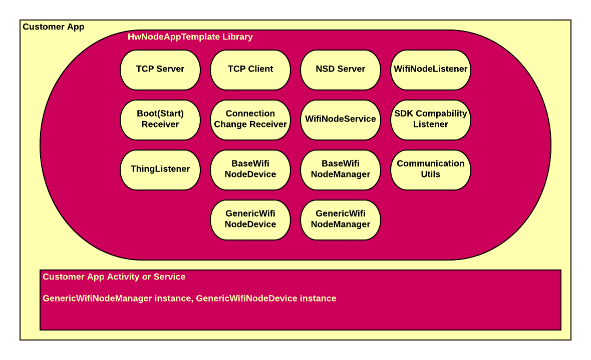

## HwNodeAppTemplate Library

This library covers APIs that handles connection between node and IoTIgnite over Wifi.
Library covers the following functionalities: Network Service Discovery, TCP/IP server, IotIgnite connnection handler.
Add this library to your project's app gradle dependencies in Android Studio as ** compile 'com.ardic.android.iot:HwNodeAppTemplates:1.0' **.

WifiNodeDevice class implements basic functions needed for IotIgnite Wifi connection. By means of this library, you can implement the following handlers:
 - A specific mDNS service enables node to dynamically receive your listening IP address and port (Network Service Discovery Server)
 - TCP/IP server that listens sockets connected by nodes 
 - TCP/IP client socket that reads node data and writes node configuration or commands
 - If your application is implemented as a service, it automatically starts after a device boot (Boot Completed Receiver)
 - Monitoring Wifi network connection state and restarting related services when a Wifi connection issue occurs (Connection State Changed Receiver)
 - Handling version conflict when IgniteSDKs used in Ignite Agent and Customer App are incompatible (Ignite SDK Compatibility Listener)
 - Monitoring socket and IotIgnite connections and handling connection issues (Socket and Ignite Connection Listener)
 - Sending data to Ignite and receiving action and configuration mesages from it

_**IotIgnite Dynamic Node Example**_ sample application demonstrates the usage of this library.
